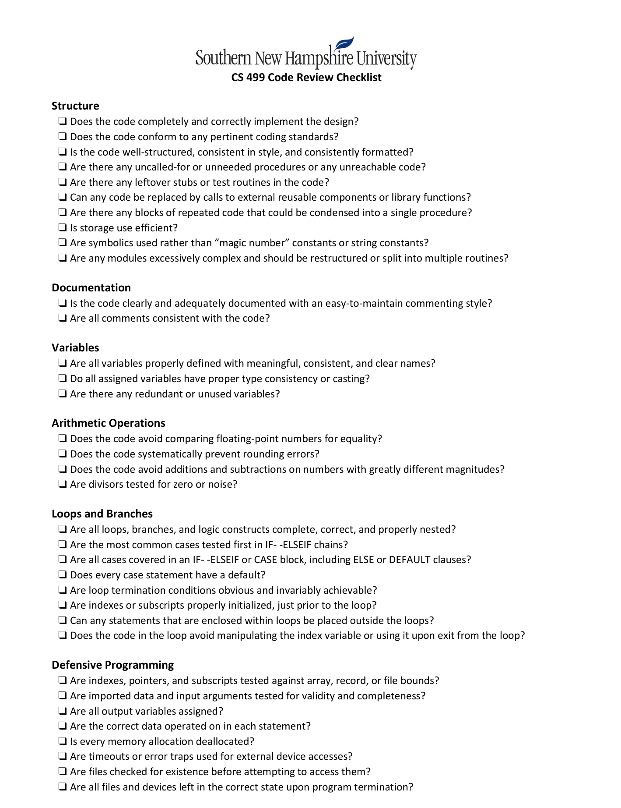

# earlpfau.github.io

## Enhancement Project
The following is the project from my CS499 - Computer Science Capstone, with Southern New Hampshire University.

## What is the project?
The project is to enhance three artifacts from previouse course work or from other personal projects.
I choose the same project for my artifacts to enhance.
The categories for this enhancement project is:
- Software Design and Engineering
- Algorithms and Data Structures
- Databases

## The Artifact
My artifact is my Investment Calculator Application from the course CS210 - Programming Languages, back from February 2025 - which is a console app written in C++.
The reason I chose to enhance this entire project rather than enhancing multiple projects is because this was one of my first C++ programs that I felt could be enhanced in all three categories. 

## Enhancements
- To start this project off I did a self-code review of the potential artifacts within my Investment Calculator Application, which is in the form of a short video.
-  Then I moved into enahnacement one - Software Design and Engineering.
- Then I moved on to enhancement two - Algorithms and Data Structures. (Completed, but waiting on feedback.)
- Then for the final enhancement three - Databases. (Started, but not complete.)

## Self-Code Review
<ins><strong>Code Review Video</strong></ins>
&nbsp;&nbsp;&nbsp;&nbsp;&nbsp;&nbsp;&nbsp;&nbsp;&nbsp;&nbsp;&nbsp;&nbsp;&nbsp;&nbsp;&nbsp;&nbsp;&nbsp;&nbsp;&nbsp;&nbsp;&nbsp;&nbsp;&nbsp;&nbsp;&nbsp;&nbsp;&nbsp;&nbsp;&nbsp;&nbsp;&nbsp;&nbsp;&nbsp;&nbsp;&nbsp;&nbsp;&nbsp;&nbsp;&nbsp;&nbsp;&nbsp;&nbsp;&nbsp;&nbsp;&nbsp;&nbsp;&nbsp;&nbsp;&nbsp;&nbsp;&nbsp;&nbsp;&nbsp;&nbsp;&nbsp;&nbsp;&nbsp;&nbsp;&nbsp;&nbsp;&nbsp;&nbsp;&nbsp;&nbsp;&nbsp;&nbsp;&nbsp;&nbsp;&nbsp;&nbsp;&nbsp;&nbsp;&nbsp;&nbsp;&nbsp;&nbsp;&nbsp;&nbsp;
<ins><strong>Code Review Checklist</strong></ins>

Click on the video or use this link https://youtu.be/rqeax5MER7k

 <a href="Docs/cs499_code_review_checklist.pdf"> 
  

## Enhancement One

